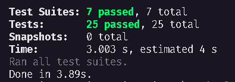

<h1 align="center">
SOLIDUsersAPI - Desafio 04 - Introdução ao SOLID Concluido
</h1>

## 💫 Sobre o desafio
Essa será uma aplicação de listagem e cadastro de usuários. Para que a listagem de usuários funcione, o usuário que solicita a listagem deve ser um admin.

## ✅ Testes

## 🚀 Tecnologias 

---